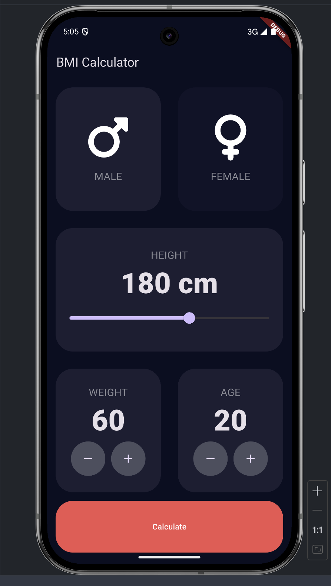

# BMI Calculator

A Flutter-based BMI Calculator app available for both Android and iOS. It features a beautiful, minimalist UI that allows users to calculate their Body Mass Index (BMI) based on their height, weight, and age.

## 📱 Features

- **Cross-Platform**: Works on both Android & iOS.
- **Modern UI**: Designed with a clean and elegant dark-themed interface.
- **User-Friendly**: Easy-to-use input controls for height, weight, and age.
- **Dynamic Results**: Displays BMI result in color-coded format:
  - ✅ Green for Normal Weight
  - ⚠️ Yellow for Overweight
  - ❌ Red for Obese

## 📸 Screenshot



## 🛠️ Technologies Used

- **Flutter (Dart)**
- **Material Design** for UI components

## 🚀 Getting Started

Clone this repository:
```sh
git clone https://github.com/your-username/bmi-calculator.git
```

Navigate to the project directory:
```sh
cd bmi-calculator
```

Install dependencies:
```sh
flutter pub get
```

Run the app:
```sh
flutter run
```

## 📌 License

This project is open-source and available under the MIT License.

---

💡 **Made with Flutter 💙**

